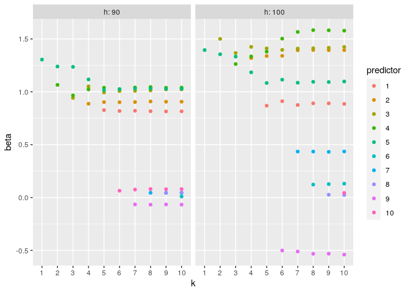
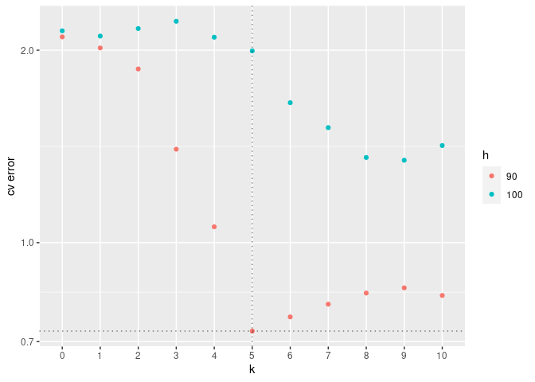

# robustsubsets

## Overview

An R implementation of robust subset selection as described
[here](https://arxiv.org/abs/2005.08217).

Robust subset selection is a robust adaption of the classic best subset
selection estimator, and is defined by the constrained least squares
problem:

<!-- -->

Robust subsets seeks out the best subset of predictors and observations
and performs a least squares fit on this subset. The number of
predictors used in the fit is controlled by the parameter `k` and the
observations by the parameter `h`.

## Installation

You should install Gurobi and the associated R package gurobi before
installing robustsubsets. Gurobi is available for free under academic
license at <https://www.gurobi.com/>.

To install robustsubsets from GitHub, run the following code:

``` r
devtools::install_github('ryan-thompson/robustsubsets')
```

## Usage

The `rss` function is the primary function for robust subset selection,
it calls `rss.fit` and `rss.cv` to fit and cross-validate the model over
various values of `k` and `h`.

``` r
library(robustsubsets)

# Generate training data with contaminated predictor matrix
set.seed(1)
n <- 100 # Number of observations
p <- 10 # Number of predictors
p0 <- 5 # Number of relevant predictors
n.c <- 5 # Number of contaminated observations
beta <- c(rep(1, p0), rep(0, p - p0))
X <- matrix(rnorm(n * p), n, p)
y <- X %*% beta + rnorm(n)
X[1:n.c, ] <- matrix(rnorm(n.c * p, mean = 10), n.c, p)

# Fit with k=0,...,10 and h=90,100
fit <- rss(X, y, k = 0:10, h = function(n) round(c(0.90, 1.00) * n))

# Plot coefficient profiles
plot(fit, type = 'profile')
```

<!-- -->

``` r
# Plot cross-validation results
plot(fit, type = 'cv')
```

<!-- -->

``` r
# Extract coefficients (corresponding to best parameters from cross-validation)
coef(fit)

# Make predictions (using best parameters from cross-validation)
predict(fit, X)
```

## Documentation

See [robustsubsets\_1.0.2.pdf](robustsubsets_1.0.2.pdf) for
documentation.
